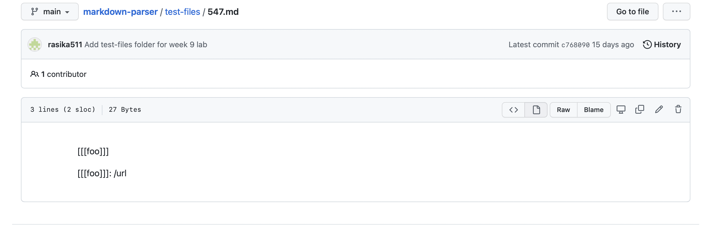
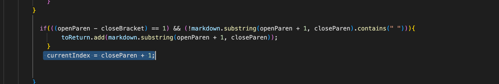

# CSE 15L
## Lab Report 5
### By: Bhakin Phanakesiri 
---
> ## Test 1 
#### Test-File: 547 : Link to the [test file](https://github.com/nidhidhamnani/markdown-parser/blob/main/test-files/547.md) 




```Expected OutPut: [] ```

Output from my repo and the TA's repo: 

- The Left Part is the output from my MarkdownParse and the Right Part is the output from the TA's MarkdownParse. 
- My MarkdownParse gave me an infinite loop since it was not able to produce any list, so therefore, my MarkdownParse gave me the wrong answer. However, for the TA's MarkdownParse, it produce the right answer which is an empty list.


> How did I find the tests with different results? 

I found the tests with different results by using vim diff. As you can see in the picture above, I used vimdiff and found that my MarkdownParse produces a different answer from the TA's MarkdownParse.  

>How can I fix my the code? 


This is the code from my MarkdownParse. The part that is highlighted should be fixed since in this test-files, there is no close paren, so adding it to the currentIndex would not work. To fix this, I think that we should not use close paren, but instead use another variable like open or close brackets. OR the another way to fix this, is to add an if statement and see if there is an open paren and close paren or not. If there is an open paren and close paren, we know that there might be a link inside, but if there is no open parent or close paren then I should return an empty list. 


> ## Test 2
#### Test-File: 488
