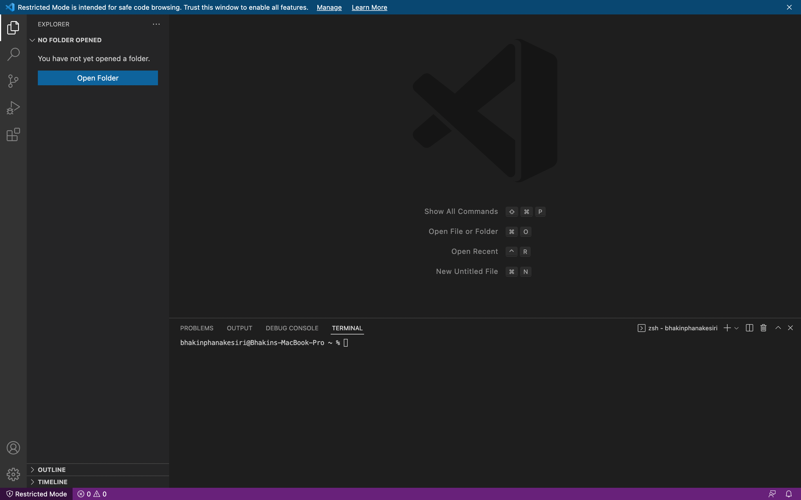
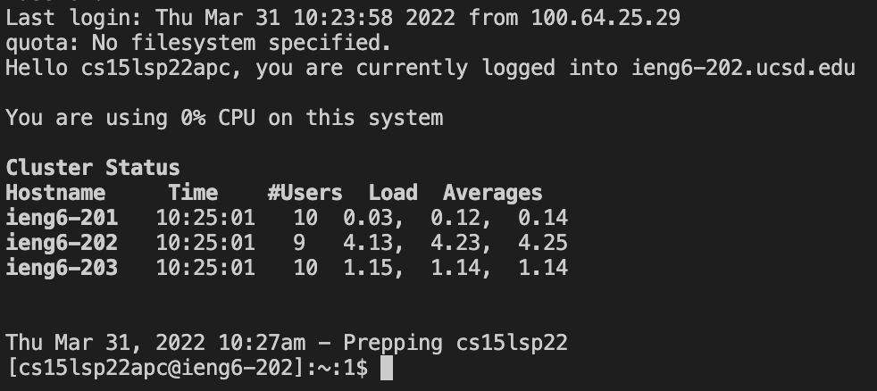
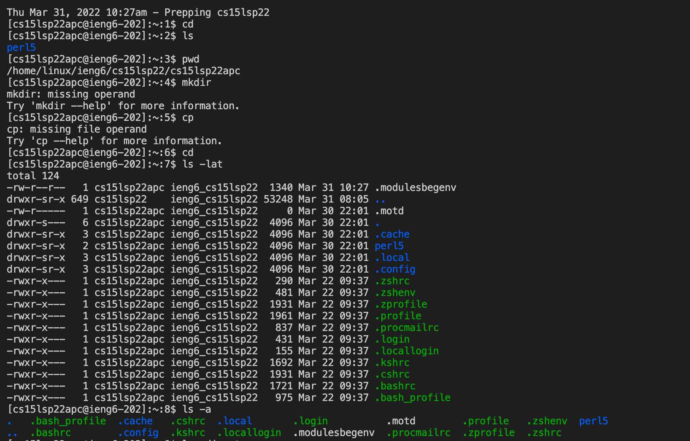
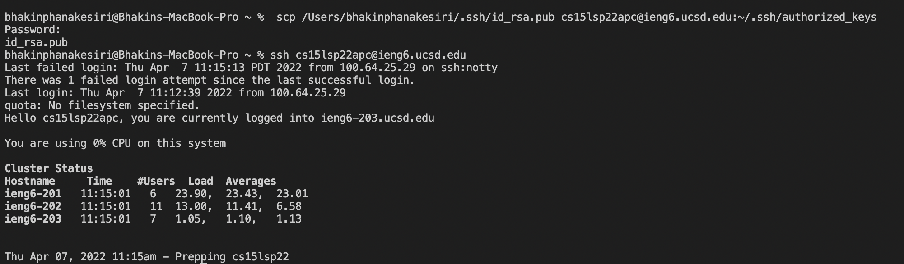
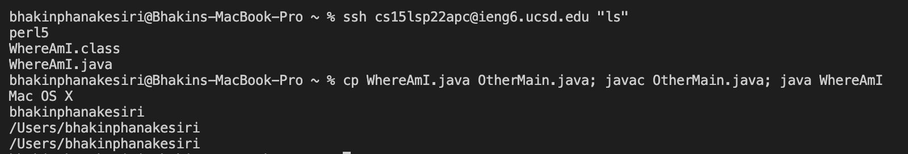

# Welcome to CSE 15L
## Tutorial for incoming CSE 15L students
### By Bhakin Phanakesiri 

> **`Step 1: Install VS Code`**


```
- Download VS Code
- Open up VS Code on your device
```

> **`Step 2: Connecting to the Server`**


```
- Go on your terminal and type ssh (your cs15l account)
- Then enter your password for your account
```

> **`Step 3: Trying Some Command`**



```
- When you are connected to the server, run some commands to see what will happen.
- Commands: cd, ls, pwd, mkdir, cp, ls -lat, ls -a
```

> **`Step 4: Moving Files with scp`**

![pic4]

```
- Create a file one your computer and save it
- Then go on your terminal and type scp (the file name) cs15lsp22zz@ieng6.ucsd.edu:~/ 
- To check if the file has been copied to your cs15l account, type ls and see if the name of your file is listed there or not. 
```


> **`Step 5: Setting an SSH Key`**



```
- Create a new key on you device by typing ssh-keygen on your personal server. 
- Then type scp /Users/<user-name>/.ssh/id_rsa.pub cs15lsp22zz@ieng6.ucsd.edu:~/.ssh/authorized_keys
with your name and cs15l account on your personal server
- Lastly, enter your cs15l account's password
```

> **`Step 6: Optimizing Remote Running`**



```
- We can optimize remote running by writing more than one command in a line
- For example, when we run: cp WhereAmI.java OtherMain.java; javac OtherMain.java; java WhereAmI . We would get all of the output from each of the command.  
```

# Thank You