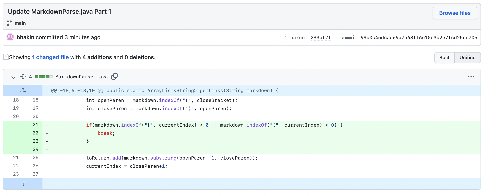
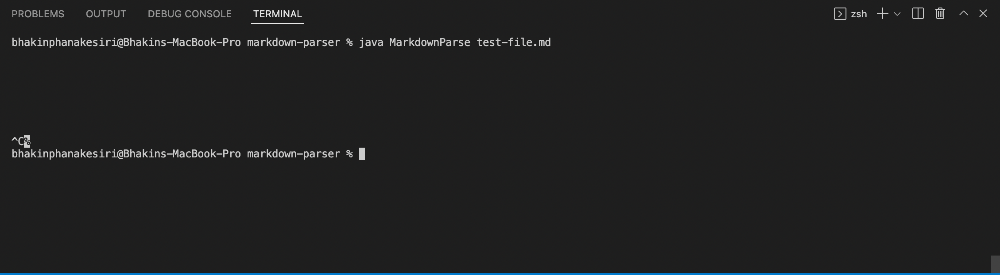
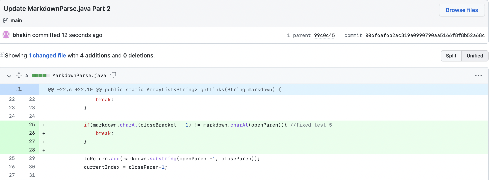
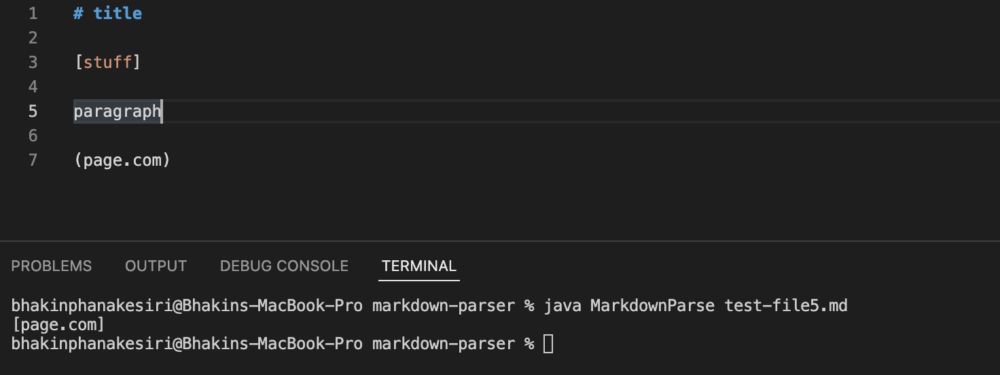
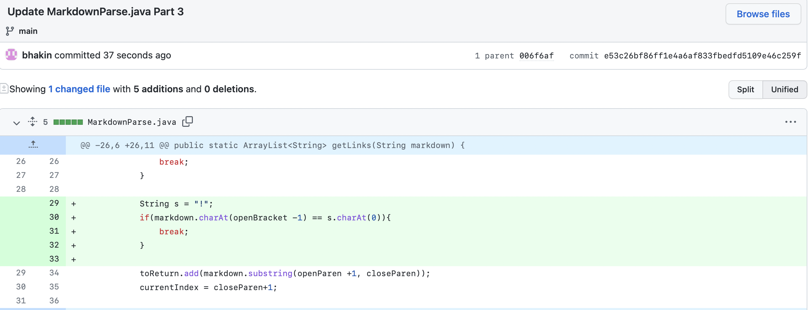
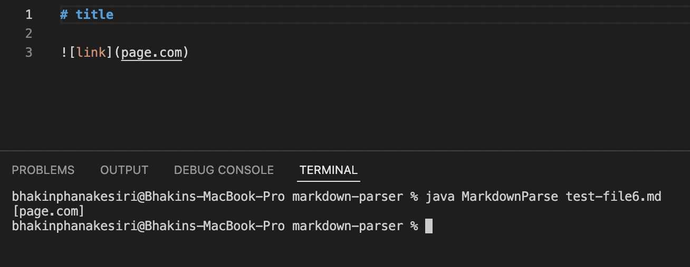

# CSE 15L
## Lab Report 2
### By: Bhakin Phanakesiri 

---
> **CODE 1**

[Link](https://github.com/bhakin/markdown-parser/blob/main/test-file.md) to the failure-inducing test file. 

Symptom:

- The symptom for this case is the infinite loop since no codes should be producing an infinite loop.
- The bug is here is the logic error since the the code was not able to stop looking for a link when there is an extra line on the file. 
- In this case, the failure-inducing input is the test-file.md, but this symptom will appear on a file that has an extra line at the end. 

---
> **CODE 2**

[Link](https://github.com/bhakin/markdown-parser/blob/main/test-file5.md) to the failure-inducing test file.  

Symptom: 

- The symptom here is that the codes give us the wrong answer. The answer we are looking for is an empty array, but instead, it gives us a link that appears after a paragraph. 
- A bug, in this case, is the code's inability to detect a paragraph between the brackets and the parenthesis. 
- In this case, the failure-inducing input is the test-file5.md, but this symptom will appear on a file that has something in between the brackets and the parenthesis. 

---
> **CODE 3**

[Link](https://github.com/bhakin/markdown-parser/blob/main/test-file6.md) to the failure-inducing test file.  

Symptom:

- The symptom here is that the code gives us the wrong output. As we can see in the picture above, this is not a link, it is a picture so therefore the correct answer should be an empty array. 
- Similarly, the bug is the code's inability to differentiate a link and a picture. 
- In this case, the failure-inducing input is the test-file6.md, but this symptom will come up when we try to implement a picture on markdown.

---

# Thank You!
