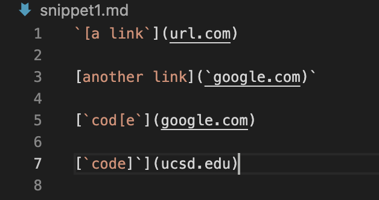
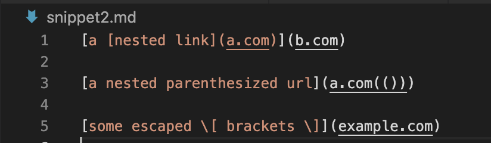
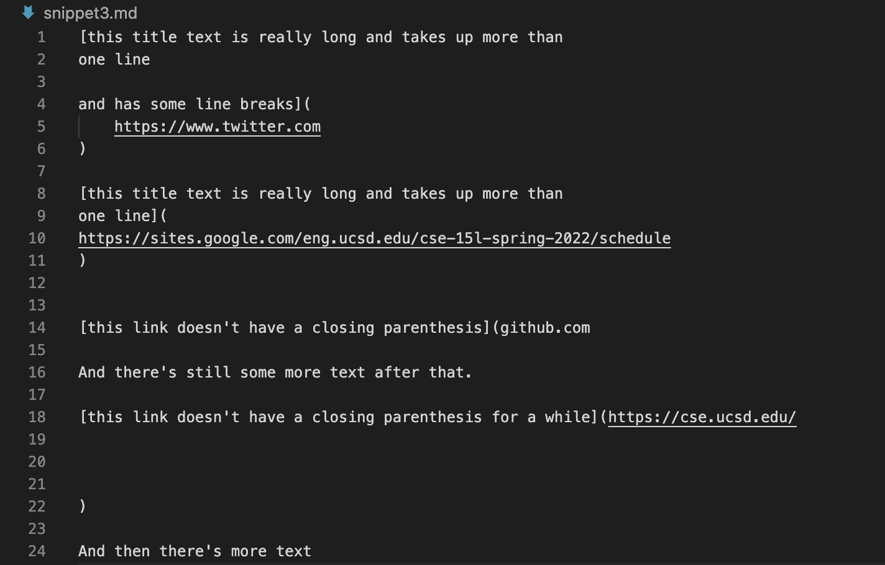

# CSE 15L
## Lab Report 4
### By: Bhakin Phanakesiri 

**_____________________________________________________________________________________________________________**
**Repo**

[My Repo](https://github.com/bhakin/markdown-parser)

[The person I reviewed repo](https://github.com/Trinnnn/markdown-parser)


**Snippet 1**

- Expected Output: ```[google.com, google.com, ucsd.edu]```


2.


**Snipper 2**

- Expected Output: ```[a.com, a.com(()), example.com]```


**Snippet 3***

- Expected Output: ```[https://sites.google.com/eng.ucsd.edu/cse-15l-spring-2022/schedule]]```


**Questions**
1. Do you think there is a small (<10 lines) code change that will make your program work for snippet 1 and all related cases that use inline code with backticks? If yes, describe the code change. If not, describe why it would be a more involved change.

>Answer: 

2. Do you think there is a small (<10 lines) code change that will make your program work for snippet 2 and all related cases that nest parentheses, brackets, and escaped brackets? If yes, describe the code change. If not, describe why it would be a more involved change.

>Answer:


3. Do you think there is a small (<10 lines) code change that will make your program work for snippet 3 and all related cases that have newlines in brackets and parentheses? If yes, describe the code change. If not, describe why it would be a more involved change.

>Answer:

4. If your code already works on some/all test cases, include an explanation of what were the code changes that allowed the tests to pass.

>Answer