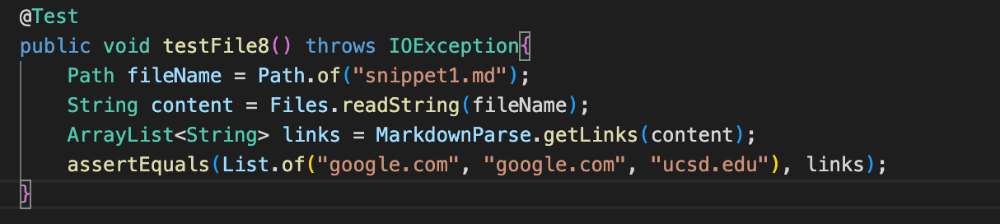

# CSE 15L
## Lab Report 4
### By: Bhakin Phanakesiri 

**_____________________________________________________________________________________________________________**
### **Repo**

[My Repo](https://github.com/bhakin/markdown-parser)

[The person I reviewed repo](https://github.com/Trinnnn/markdown-parser)

**_____________________________________________________________________________________________________________**
### **Snippet 1**


- Expected Output: ```[google.com, google.com, ucsd.edu]```

> Tester Method:




> My Output: 


- My code fails the test because it was not able to detect the ucsd.edu link, but instead it got url.com which is not a valid. 


> The person I reviewed Output:


- Thier code fails the test because their code was able to pick up url.com when it shouldn't have. 


**_____________________________________________________________________________________________________________**
### **Snipper 2**


- Expected Output: ```[a.com, a.com(()), example.com]```

> Tester Method:

 


> My Ouput:


- My code fails the test because for the seonond link, it should be a.com(()), but instead it was only a.com((. In addition, my code was not able to detect example.com which is a valid link. 


> The person I reviewed Output: 


- Their code fails the test because for the second link, it should be a.com(()), but instead it was only a.com((.


**_____________________________________________________________________________________________________________**
### **Snippet 3**


- Expected Output: ```[https://sites.google.com/eng.ucsd.edu/cse-15l-spring-2022/schedule]```

> Tester Method:


> My Output:


- Even though my code was able to get the correct link, but it still fails the test because it has a space in the front and in the back and this is wrong since it should not pick up any empty spaces. 


> The person I reviewed Output: 


- Their code fails the test because it returns an empty list even though there is a link in this file which is https://sites.google.com/eng.ucsd.edu/cse-15l-spring-2022/schedule


**_____________________________________________________________________________________________________________**
**Questions**

1) Do you think there is a small (<10 lines) code change that will make your program work for snippet 1 and all related cases that use inline code with backticks? If yes, describe the code change. If not, describe why it would be a more involved change.

>Answer: No, I don't think there is a small code change that could make my program work for snippet 1. The reason why I think there is no small code change that could help is because checking for backticks is a new condition that I haven't look into yet. So therefore it would require more than 10 lines to check the backticks and making sure it could pick up the correct link. 

2) Do you think there is a small (<10 lines) code change that will make your program work for snippet 2 and all related cases that nest parentheses, brackets, and escaped brackets? If yes, describe the code change. If not, describe why it would be a more involved change.

>Answer: Yes, I think that there is a small code change that could make my program work for snippet 2. The small change could be making sure that the content inside the brackets is not finished until there is a open parenthesis next the close bracket. I could do these changes by creating an if statement to check if the close bracket is next to the open parentehsis. 


3) Do you think there is a small (<10 lines) code change that will make your program work for snippet 3 and all related cases that have newlines in brackets and parentheses? If yes, describe the code change. If not, describe why it would be a more involved change.

>Answer: Yes, I think that there is a small code change that could make my program work for snippet 3. The small change could be detecting spaces or a new line indentation. For example, I could write a if statement to see if there is a space in front of the pareenthesis. 

4) If your code already works on some/all test cases, include an explanation of what were the code changes that allowed the tests to pass.

>Answer: My code did not pass any of the snippet files. 

**_____________________________________________________________________________________________________________**
# Thank You!