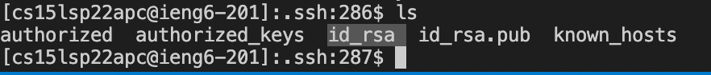
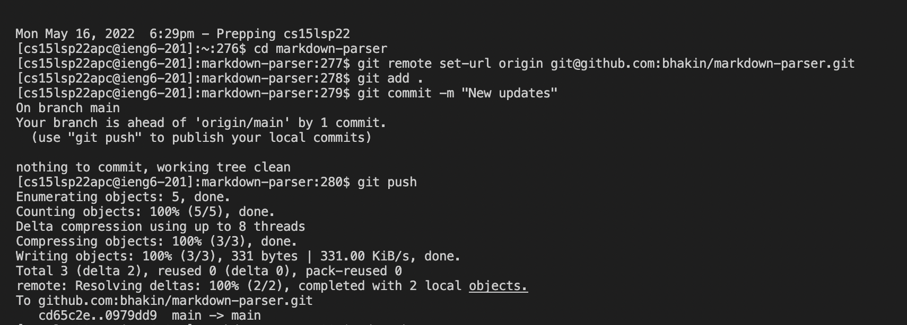
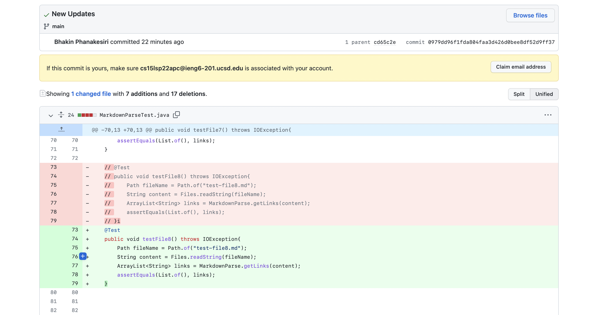

# CSE 15L
## Lab Report 3
### By: Bhakin Phanakesiri 

**_____________________________________________________________________________________________________________**
> **Group Choice 1: Streamlining ssh Configuration**


- First, I looked for the .SSH file on my computer and create a new file called config.
- Then, I copied the code below to the config file:
```
Host ieng6
    HostName ieng6.ucsd.edu
    User cs15lsp22zzz (use your username)
```
---

- After I saved the config file, I opened the terminal and typed ```ssh ieng6``` and the result is the picture above.
- ieng6 is the username I chose to replace my cs15l account.

---

- Then, I copied MarkdownParse.java to the server using my new username. 
- This command below is what I used to copied MarkdownParse.java to the server
```
scp MarkdownParse.java ieng6:~/
```


**______________________________________________________________________________________________________________**
> **Group Choice 2: Setup Github Acess from ieng6**


- The public key is stored in in the SSH and GPG keys. 
- To find the SSH and GPG keys, I first clicked on my profile account on the top right.
- Then I clicked setting. 
- Lastly, in the left column of the setting page, I clicked on SSH and GPG keys. 


---

- The private key is stored in a folder called .ssh on my cs15l account. 
- The file that the private key is stored in is called the id_rsa and the id_rsa.pub is for public key. 

---

- In the picture above, I logged into my cs15l account then wrote the command: ``` git remote set-url orgin (SSH Link)``` so that I could commit and push my changes on my cs15l account without entering the password to my github account. 
-  Then I committed and push my markdown parser repo. 
-  And as we can see, when I push my markdown parser, it didn't ask for my password to my Github account. 

---

- [Link to the pictiure above. ](https://github.com/bhakin/markdown-parser/commit/0979dd96f1fda804faa3d426d0bee8df52d9ff37) 
- This is the link that shows the commit message I made on my cs15l account. 

**______________________________________________________________________________________________________________**
> **Group Choice 3: Copy whole directories with scp -r**


- I copied the markdown-parser repo by using this command: 
```
scp -r . cse15lsp22apc@ieng6.ucsd.edu:~/markdown-parser
```
- The picture above shows the result after I ran the command.

---

- After copying the markdown-parser repo into my cs15l account, I logged into my cs15l account so that I could compile and run MarkdownParseTest.java. 
- The picture above shows the result after I ran MarkdownParseTest.java.

---

- Lastly, I tried to optimize time by running everything I just did in one line. 
- The picture above shows me running everything I just did in one line. 
    1. The first command is copying the markdown-parser into my cs15l account. 
    2. The second command is logging into my cs15l account. 
    3. The third command is compiling MarkdownParseTest.java.
    4. The fourth command is running MarkdownParseTest.java.

---
# Thank You!
