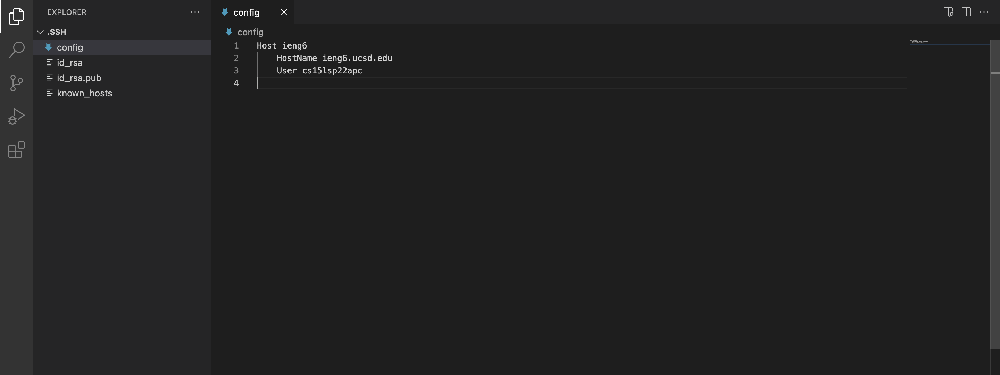
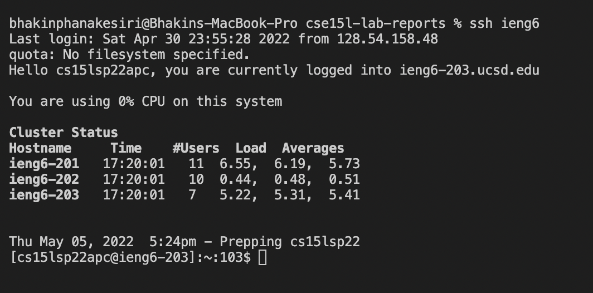
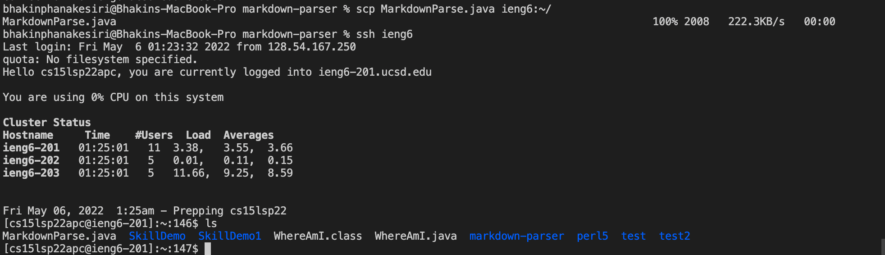
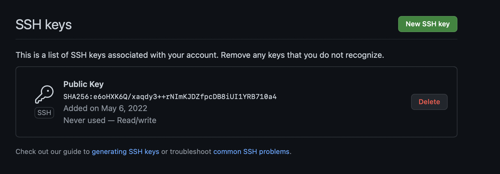
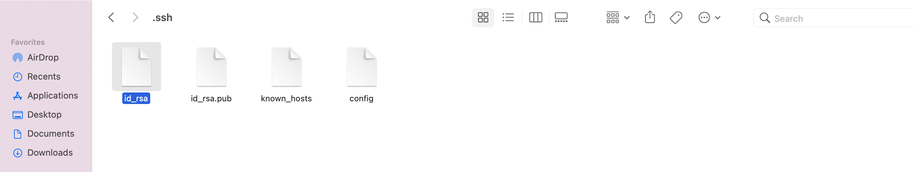
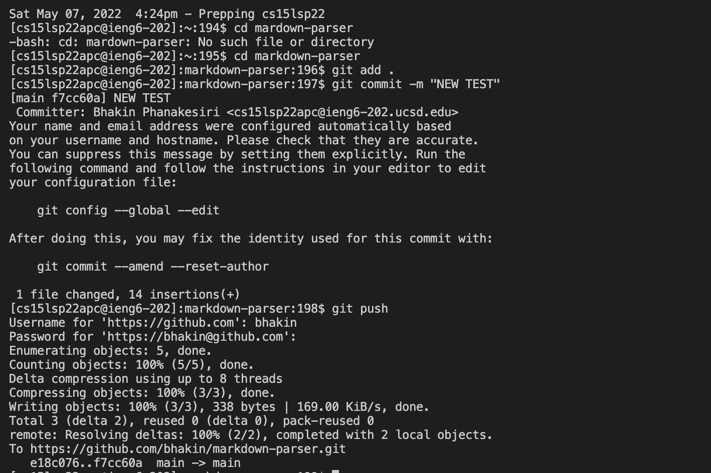
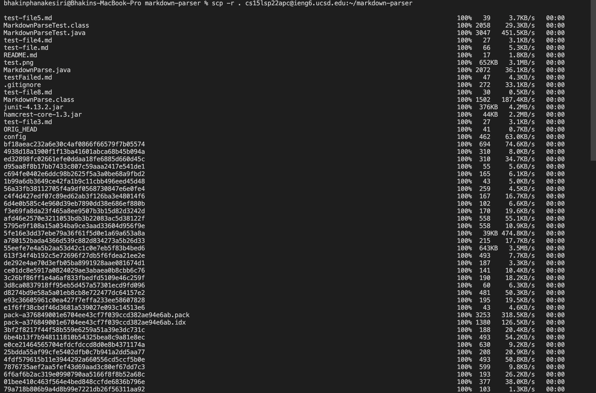
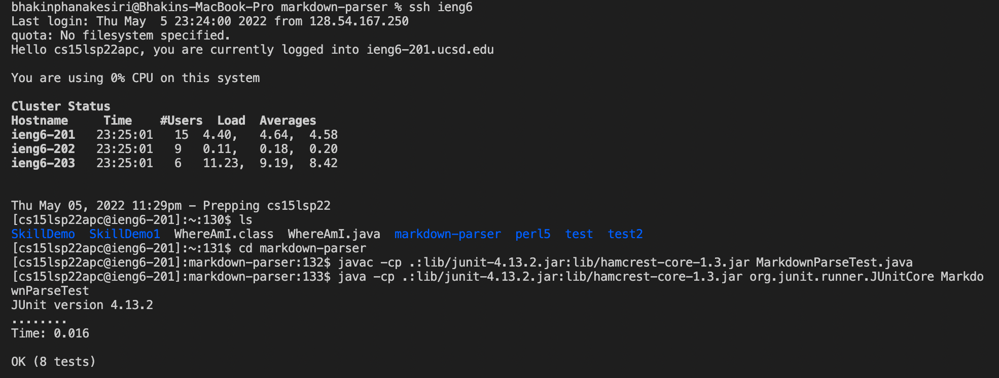
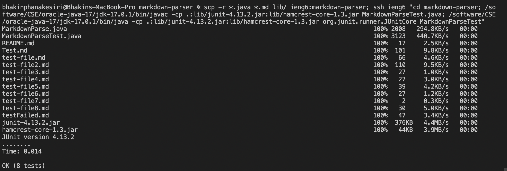

# CSE 15L
## Lab Report 3
### By: Bhakin Phanakesiri 

**_____________________________________________________________________________________________________________**
> **Group Choice 1: Streamlining ssh Configuration**


- First, I looked for the .SSH file on my computer and create a new file called config.
- Then, I copied the code below to the config file:
```
Host ieng6
    HostName ieng6.ucsd.edu
    User cs15lsp22zzz (use your username)
```
---

- After, I saved the config file, I opened the terminal typed ssh ieng6 and the result is the picture above.
- ieng6 is the username I chose to replace my cs15l account.

---

- Then, I copied MarkdownParse.java to the server using my new username. 
- As we can see in the picture above, I sucessfully copied MarkdownParse.java to my cs15l account. 


**______________________________________________________________________________________________________________**
> **Group Choice 2: Setup Github Acess from ieng6**








**______________________________________________________________________________________________________________**
> **Group Choice 3: Copy whole directories with scp -r**


- I copied the markdown-parser repo by using this command: 
```
scp -r . cse15lsp22apc@ieng6.ucsd.edu:~/markdown-parser
```
- The picture above shows the result after I ran the command.

---

- After copying the markdown-parser repo into my cs15l account, I logged into my cs15l account and complile and run MarkdownParseTest.java. 
- The picture above shows the result after I rand MarkdownParseTest.java.

---

- Lastly, I tried to optimize time by running everything I just did in one line. 
- The picture above shows me running everything I just did in one line. 
    1. The first command is copying the markdown-parser into my cs15l account. 
    2. The second command is logging into my cs15l account. 
    3. The third command is compiling MarkdownParseTest.java.
    4. The fourth command is running MarkdownParseTest.java.
