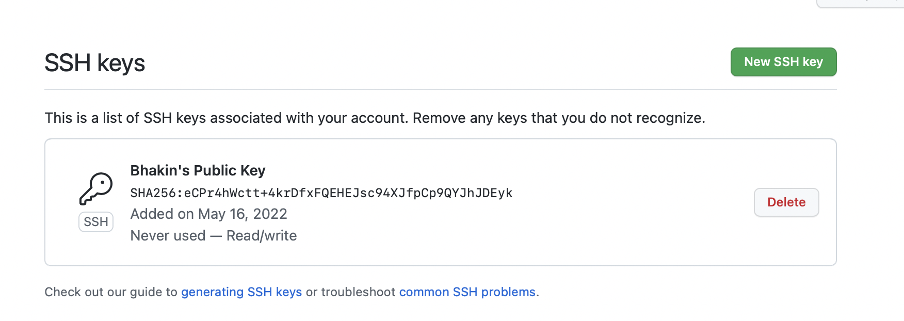

# CSE 15L
## Lab Report 3
### By: Bhakin Phanakesiri 

---
> **Group Choice 1: Streamlining ssh Configuration**


- First, I looked for the .SSH file on my computer and create a new file called config.
- Then, I copied the code below to the config file:
```
Host ieng6
    HostName ieng6.ucsd.edu
    User cs15lsp22zzz (use your username)
```


- After, I saved the config file, I opened the terminal typed ssh ieng6 and the result is the picture above.
- ieng6 is the username I chose to replace my cs15l account.


- Then, I copied MarkdownParse.java to the server using my new username. 
- As we can see in the picture above, I sucessfully copied MarkdownParse.java to my cs15l account. 


---
> **Group Choice 2: Setup Github Acess from ieng6**




> **Group Choice 3: Copy whole directories with scp -r**


